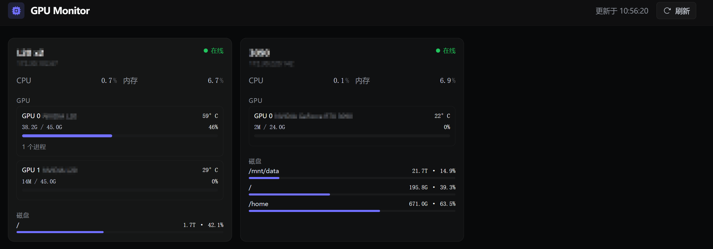

# GPU Monitor

Real-time multi-server GPU health dashboard. SSH into configured GPU servers, collect metrics via `nvidia-smi` + `psutil`, and render a dark-themed dashboard. No persistent agent processes required on monitored machines.

  


## Features

- **Multi-server monitoring** — one dashboard for all your GPU machines
- **Per-GPU metrics** — utilization, memory (used / total), temperature, model name
- **Process details** — click any GPU to see who's using it and how much memory
- **Disk monitoring** — per-mountpoint capacity with ≥ 90% warning
- **Bootstrap-free** — collector script is piped over SSH, no installation on remote hosts
- **Docker-ready** — single `docker compose up`

## Quick Start

### Prerequisites

- **Python 3.10+** (host) or **Docker** (recommended)
- SSH key access to each GPU server
- Each GPU server needs: `python3`, `psutil`, `nvidia-smi`

### 1. Clone & Configure

```bash
git clone https://github.com/your-username/gpu-monitor.git
cd gpu-monitor
```

Edit `servers.json` with your GPU servers:

```json
{
  "lab-a100": {
    "host": "10.0.0.5",
    "port": 22,
    "user": "alice",
    "key": "~/.ssh/id_rsa"
  },
  "lab-3090": {
    "host": "10.0.0.6",
    "port": 22,
    "user": "bob",
    "key": "~/.ssh/id_rsa"
  }
}
```

### 2. Run

**Docker (recommended):**

```bash
# Edit docker-compose.yml: replace `user: "1000:1000"` with your uid:gid
# Find yours with: id -u && id -g
cp .env.example .env
docker compose up -d
```

Open http://localhost:8888.

**Without Docker:**

```bash
pip install -r requirements.txt
cd web && npm install && npm run build && cd ..
python app/main.py
```

### 3. Test Locally

If you have a GPU on your dev machine:

```bash
python agent/collector.py
```

This prints the JSON that gets sent over SSH from each monitored server.

## Architecture

```
Browser ──► nginx / CDN ──► FastAPI (:8888)
                               │
                    ┌──────────┼──────────┐
                    ▼          ▼          ▼
                 SSH        SSH        SSH
               ┌─────┐   ┌─────┐   ┌─────┐
               │ GPU │   │ GPU │   │ GPU │
               │ Srv │   │ Srv │   │ Srv │
               └─────┘   └─────┘   └─────┘
```

Each SSH session pipes `agent/collector.py` to `python3 -` on the remote host. The collector runs `nvidia-smi`, `psutil`, and OS-level process inspection, then prints JSON to stdout. All concurrent via `anyio.create_task_group()`.

## Configuration

| File | Purpose |
|------|---------|
| `servers.json` | GPU server SSH config (host, port, user, key path) |
| `.env` | `PORT=8888` (copy from `.env.example`) |
| `docker-compose.yml` | Volume mounts, user mapping, network mode |

### Adding Servers Without Restart

`servers.json` is volume-mounted into the container. Edit it directly on the host — changes take effect on the next 5-second poll cycle. No restart needed.

In production, the dashboard reaches all servers concurrently. If one is offline, others still report.

## Dashboard

Labels are in Chinese (GPU/内存/磁盘/温度). Dark-mode only — designed for ops center displays.

- **Green badge** — server online, no issues
- **Amber badge** — disk ≥ 90% or GPU ≥ 90% / 85°C
- **Red badge** — server unreachable (SSH failed)

## Development

```bash
uv sync                                   # Python deps
cd web && npm install                     # Frontend deps

# Terminal 1: backend
python app/main.py                        # :8888

# Terminal 2: frontend (hot reload)
cd web && npm run dev                     # :5173 → proxies /api to :8888

# Tests
uv run pytest                             # or: python -m pytest
uv run basedpyright                       # type check
uv run ruff check                         # lint
```

## Security

> ⚠️ **Attention**: This tool relies on SSH connections between machines and is intended for use in **local network / intranet environments**. Exposing the dashboard or SSH ports to the public internet is not recommended and may introduce security risks you haven't accounted for. Use within trusted networks only.

## License

MIT

---

Built with FastAPI + React + Vite + Tailwind CSS + Paramiko.
